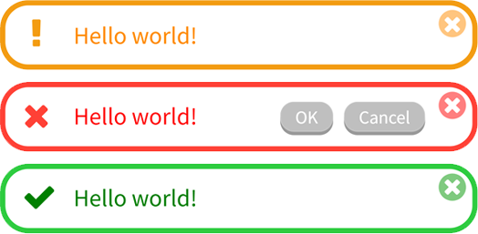
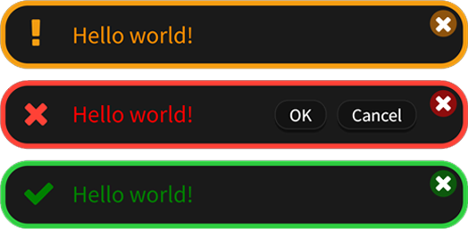
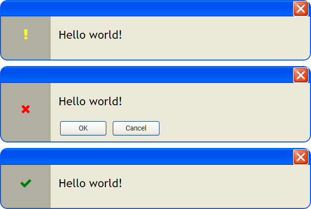

# Notification_JS     

### Quickly create a notification item

<p align="center">
  
</p>

<p align="center">
	<a href="example.html">Usage Example</a> | 
	<a href="https://superzombi.github.io/Notification_JS/example.html">Preview</a>
</p>

### Usage:

HTML:
```html
<head>
    <link href="https://superzombi.github.io/Notification_JS/notifications.css" rel="stylesheet">
    <script src="https://superzombi.github.io/Notification_JS/notifications.js"></script>
</head>
```

JavaScript:
```javascript
notice = Notification('#notifications');
  
async function func_name(){
    await notice.Warning("Hello world!", false)
    await notice.Error("Hello world!", false, [['OK', show_more], 'Cancel'])
    await notice.Success("Hello world!", 3000)
}
```

## Methods:

### ```Warning()```, ```Error()```, ```Success()``` (text, autohide, ms, buttons)
  <code>text</code> - string (Required) </br>
  <code>autohide</code> - boolean (default: <code>true</code>) </br>
  <code>ms</code> - integer (default: <code>5000</code>) (milliseconds) </br>
  <code>buttons</code> - array ( <code>[button_name]</code> )   ( <code>[[button_name, function]]</code> )
  
<hr>
<details>
	<summary>Constructor:</summary>

### ```Notification()```

<table>
	<tr>
		<th>Attribute</th>
		<th>Data type</th>
		<th>Default</th>
	</tr>
	<tr>
		<td> <code>element</code> </td>
		<td>documentElement</td>
		<td> <code>document.body</code> </td>
	</tr>
</table>
<hr>

### ```animationIN()```

<table>
	<tr>
		<th>Attribute</th>
		<th>Data type</th>
		<th>Default</th>
	</tr>
	<tr>
		<td> <code>anim_name</code> </td>
		<td>string or array or arguments</td>
		<td> <code>["scale", "opacity"]</code> </td>
	</tr>
</table>

<details>
	<summary>List of available values:</summary>
	
```javascript
["none", "opacity", "scale", "scale-right", "scale-left"]
```
<a href="plugins/animation_examples.html">Usage Example</a> | 
<a href="https://superzombi.github.io/Notification_JS/plugins/animation_examples.html">Preview</a>
</details>
<hr>
  
### ```clear()``` - Clear non active notifications

### ```clearAll()``` - Clear all notifications
  
</details>

<hr>

## Plugins

<details>
	<summary>Minimalism</summary>
	
```html
<link href="https://superzombi.github.io/Notification_JS/plugins/minimalism.css" rel="stylesheet">
```
	
<p align="center">
  
  
  <br>
  <a href="plugins/example_minimalism.html">Example</a> | 
  <a href="https://superzombi.github.io/Notification_JS/plugins/example_minimalism.html">Preview</a>
</p>
	
<hr>
	
</details>

<details>
	<summary>Windows XP</summary>
	
```html
<link href="https://superzombi.github.io/Notification_JS/plugins/windows.css" rel="stylesheet">
```
	
<p align="center">
  
  <br>
  <a href="plugins/example_windows.html">Example</a> | 
  <a href="https://superzombi.github.io/Notification_JS/plugins/example_windows.html">Preview</a>
</p>

</details>

<hr>

#### <a href="https://www.donationalerts.com/r/super_zombi">Support the project</a>
