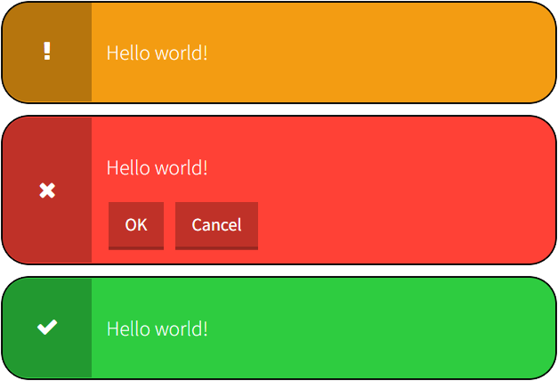
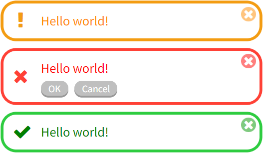
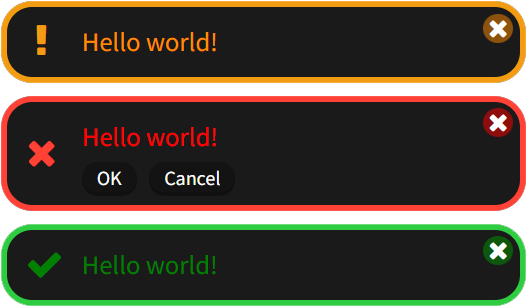

# Notification_JS
Quickly create a notification item

<p align="center">
  
</p>

## Notifications 2.0

<details>
	<summary>What's new</summary>
	
* Get rid of jQuery
* Rewritten architecture for OOP
* Reduced file size and increased work speed
	
</details>

### Usage:

HTML:
```html
<head>
    <link href="https://superzombi.github.io/Notification_JS/notifications.css" rel="stylesheet">
    <script src="https://superzombi.github.io/Notification_JS/2.0/notifications.js"></script>
</head>
```

JavaScript:
```javascript
notice = Notification('#notifications');
  
async function func_name(){
    await notice.Warning("Hello world!", false)
    await notice.Error("Hello world!", false, [['OK', show_more], 'Cancel'])
    await notice.Success("Hello world!", 3000)
}
```
<a href="/2.0/example.html">Usage Example</a> | 
<a href="https://superzombi.github.io/Notification_JS/2.0/example.html">Preview</a>
## Methods:

### ```Warning()```, ```Error()```, ```Success()``` (text, element, autohide, ms, buttons)
  <code>text</code> - string (Required) </br>
  <code>element</code> - document.Element (default: <code>document.body</code>) </br>
  <code>autohide</code> - boolean (default: <code>true</code>) </br>
  <code>ms</code> - integer (default: <code>5000</code>) (milliseconds) </br>
  <code>buttons</code> - array ( <code>[button_name]</code> )   ( <code>[[button_name, function]]</code> )
  
### ```clear()``` - Clear non active notifications

### ```clearAll()``` - Clear all notifications
  
  
<hr>

## Plugins

<details>
	<summary>Minimalism</summary>
	
```html
<link href="https://superzombi.github.io/Notification_JS/plugins/minimalism.css" rel="stylesheet">
```
	
<p align="center">
  
  
  <br>
  <a href="/plugins/example_minimalism.html">Example</a> | 
  <a href="https://superzombi.github.io/Notification_JS/plugins/example_minimalism.html">Preview</a>
</p>

</details>


<hr>

#### <a href="https://www.donationalerts.com/r/super_zombi">Support the project</a>
